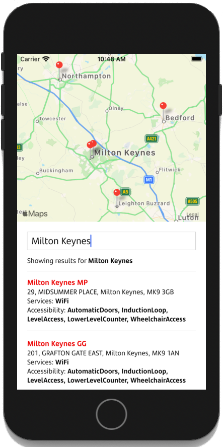

# Santander candidate technical challenge

This is the final stage of the technical interview we pose for prospective React Native candidates to join our team at Santander.

To start with, we would like you to clone the <https://github.com/christianchown-mk/rn-challenge> repo. Then, for each of the 3 tasks below please **create a new branch** in your repo. Do not worry about conflicts between your branches.

When you have completed as much as the challenges as you want (don't spend more time than you feel comfortable with), push your branches and please email us the link to your repository.

For Android, we will send you the API_KEY you'll need to use in `app.json`.

## Challenge 1

Using prop drilling from `<App />` into `<Map />` and `<BranchDetails />` of the value for `closest` isn't ideal.

We would like you to

- move the logic for `closest` out of `<App />` into a `<ClosestBranchProvider />` for `<App />` to use, and
- then inject the value into `<Map />` and `<BranchDetails />` via a `useClosestBranch()` hook

## Challenge 2

The branch accessibility and services list in `<BranchDetails />` are presented as a comma-separated list of _PascalCase_ terms. Can you change this into a more customer friendly form:

_"Item, AnotherItem, FinalItem"_ -> _"Item, another item and final item"_

## Challenge 3

We would like you to make the branch locator:

- show the 5 nearest branches instead of just 1
- zoom into the area of the 5 branches when the input changes
- make the display look like the supplied visual below

